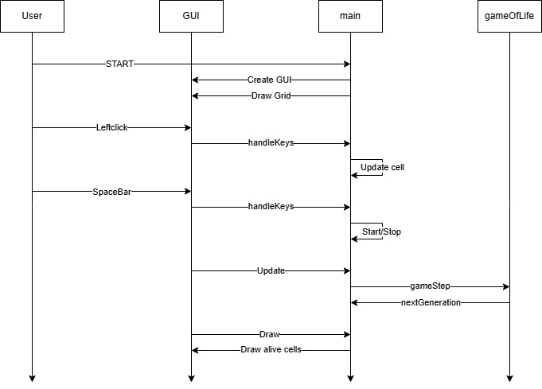

# haskell-vs-go: A Functional Perspective on Conway's Game of Life

This project explores the functional programming aspects of Haskell and Go by implementing Conway's Game of Life in both languages.

## Project Overview
- **Haskell Implementation**:
  - Built with [**Cabal**](https://github.com/haskell/cabal) for build and package management and [**Gloss**](https://github.com/benl23x5/gloss) for UI elements

- **Go Implementation**:
  - Build with **Go** and [**Ebitenengine V2**](https://github.com/hajimehoshi/ebiten) for UI elements

## Program Structure
### Overview
  The each project is divided into the same three modules:
  - const.go, Const.hs: Defines constants used across the application, such as grid size, row and column count, and other configurations.
  - gameOfLife.go, GameOfLife.hs: Contains the game logic for computing the next state of the grid based on the previous grid and the rules of Conway's Game of Life.
  - main.go, main.hs: Handles the user interface and user input.

## Flow

### GUI
  - Each GameEngine provides similar methods for the gameflow. 
  - The **main** method is used to setup the initial GameState and the necessary components for the UI
  - The **update** method is used to get the new GameState from the gamelogic module.
  - The **draw** method is used to translate the GameState to the UI.
  - Key and Mouse presses are handled differently: In Haskell the method **handleKeys** is used for both. In Go the gameengine provides methods (**ebiten.IsKeyPressed(ebiten.KeySpace)**, **ebiten.IsMouseButtonPressed(ebiten.MouseButtonLeft)**) for checking. These are used in the update method.

### GameOfLife logic
1. Rules:
  - Dead -> Alive: 3 neighbors
  - Dead -> Dead: more or less that 3 neighbors
  - Alive -> Alive: 2 or 3 neighbors
  - Alive -> Dead: less that 2 or more that 3 neighbors
  - Extra rule: In the board edges the neighbors are always dead to provide a natural border
2. Flow
  - **gameStep** method gets the current alive neighbors as x and y coordinates and returns a list of the next generation.
  - in **gameStep** the neighbors are counted from x-1, y-1 to x+1, y+1 and based on the rules the next generation is calculated

3. Flowdiagram



## How to Build and Run

### Haskell (src\haskell)
1. Ensure GHC and Cabal is installed
2. Build the project:
   ```bash
   cabal build
   ```
3. Run the project:
   ```bash
   cabal run
   ```
4. Usage: 
    - Left click to place or delete a cell
    - Space bar to resume or pause the simulation
5. There is a known bug for windows on "cabal run": 
    ```
    haskell: user error (unknown GLUT entry glutInit)
    ```
    This happens because GLUT is not correctly configured by Cabal and Gloss.
    A easy solution for Windows this is to place the "glut32.dll" found in dll\glut32.dll in C:\Windows\System32

### Go (src\go)
1. Ensure Go is installed
2. Run the project:
  ```bash
  go run .
  ```
3. Build and run the project
  ```bash
  go build
  .\haskell-vs-go.exe
  ```
4. Usage: 
    - Left click to place or delete a cell
    - Space bar to resume or pause the simulation
5. Run tests (only the gameOfLife.go file is unit tested)
  ```bash
  go test -v
  ```
